# ReportBogiePosi.json Structure Analysis

This file is a SQL Server Reporting Services (SSRS) report definition file that defines a report for displaying bogie position data in a tabular format.

## Mermaid Graph Representation

```mermaid
graph TD
    Report[Report] --> DataSources
    Report --> DataSets
    Report --> ReportSections
    Report --> ReportParameters
    Report --> ReportParametersLayout
    Report --> EmbeddedImages
    
    DataSources --> DataSource[DataSource: BTModel]
    DataSource --> ConnectionProperties
    ConnectionProperties --> DataProvider[DataProvider: System.Data.DataSet]
    ConnectionProperties --> ConnectString[ConnectString: Local Connection]
    
    DataSets --> DataSet[DataSet: DataSetBogiePosi]
    DataSet --> Query
    DataSet --> Fields
    DataSet --> DataSetInfo
    
    Query --> DataSourceName[DataSourceName: BTModel]
    Query --> CommandText[CommandText: Local Query]
    
    Fields --> Field1[Field: dataKind]
    Fields --> Field2[Field: dataXh]
    Fields --> Field3[Field: diffLow]
    Fields --> Field4[Field: diffUp]
    Fields --> Field5[Field: Is# print]
    Fields --> Field6[Field: memBz]
    Fields --> Field7[Field: stdValue]
    Fields --> Field8[Field: sybwAbbr]
    Fields --> Field9[Field: sybwbh]
    Fields --> Field10[Field: sybwmc]
    Fields --> Field11[Field: valueunit]
    Fields --> Field12[Field: zxjxh]
    
    DataSetInfo --> DataSetName[DataSetName: BT.Model]
    DataSetInfo --> TableName[TableName: Model_TblBogiePosi]
    DataSetInfo --> ObjectDataSourceType
    
    ReportSections --> ReportSection
    ReportSection --> Body
    ReportSection --> Page
    
    Body --> ReportItems1[ReportItems]
    ReportItems1 --> Tablix[Tablix2]
    
    Tablix --> TablixBody
    Tablix --> TablixColumnHierarchy
    Tablix --> TablixRowHierarchy
    Tablix --> DataSetName2[DataSetName: DataSetBogiePosi]
    
    TablixBody --> TablixColumns
    TablixBody --> TablixRows
    
    TablixColumns --> TablixColumn1[Column 1]
    TablixColumns --> TablixColumn2[Column 2]
    TablixColumns --> TablixColumn3[Column 3]
    TablixColumns --> TablixColumn4[Column 4]
    TablixColumns --> TablixColumn5[Column 5]
    TablixColumns --> TablixColumn6[Column 6]
    TablixColumns --> TablixColumn7[Column 7]
    
    TablixRows --> HeaderRow[Header Row]
    TablixRows --> DetailRow[Detail Row]
    
    HeaderRow --> HeaderCell1[序号]
    HeaderRow --> HeaderCell2[数据项名称]
    HeaderRow --> HeaderCell3[标准值]
    HeaderRow --> HeaderCell4[标准值-]
    HeaderRow --> HeaderCell5[标准值+]
    HeaderRow --> HeaderCell6[数据单位]
    HeaderRow --> HeaderCell7[是否打印]
    
    DetailRow --> DetailCell1[dataXh]
    DetailRow --> DetailCell2[sybwmc]
    DetailRow --> DetailCell3[stdValue]
    DetailRow --> DetailCell4[diffLow]
    DetailRow --> DetailCell5[diffUp]
    DetailRow --> DetailCell6[valueunit]
    DetailRow --> DetailCell7[Is# print]
    
    Page --> PageHeader
    Page --> PageFooter
    
    PageHeader --> ReportItems2[ReportItems]
    ReportItems2 --> Image[Image: logo2_1]
    ReportItems2 --> Textbox1[Textbox: 转向架试验数据项]
    ReportItems2 --> Textbox2[Textbox: BogieType Parameter]
    ReportItems2 --> Textbox3[Textbox: 转向架型号]
    
    PageFooter --> ReportItems3[ReportItems]
    ReportItems3 --> PageNumber[Textbox: PageNumber]
    
    ReportParameters --> BogieType[Parameter: BogieType]
    
    ReportParametersLayout --> GridLayoutDefinition
    GridLayoutDefinition --> CellDefinitions
    
    EmbeddedImages --> logo2_1[Image: logo2_1]
```

## Key Components

1. **Report Structure**:
   - The report is designed to display bogie position data in a tabular format
   - It includes a header with a logo and title
   - The main content is a table with 7 columns

2. **Data Source**:
   - Uses a System.Data.DataSet data provider
   - References a local connection

3. **Dataset**:
   - Named "DataSetBogiePosi"
   - Contains 12 fields including dataXh (序号), sybwmc (数据项名称), stdValue (标准值), etc.

4. **Table Structure**:
   - Header row with column titles
   - Detail row that displays data from the dataset
   - Columns include: 序号, 数据项名称, 标准值, 标准值-, 标准值+, 数据单位, 是否打印

5. **Parameters**:
   - BogieType - Used to specify the bogie type in the report header

6. **Embedded Resources**:
   - Contains an embedded logo image (logo2_1)

This report appears to be designed for displaying and # printing bogie position test data with standard values and acceptable ranges.
