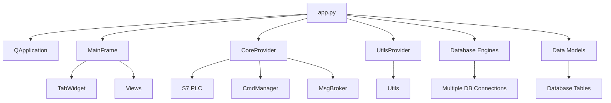
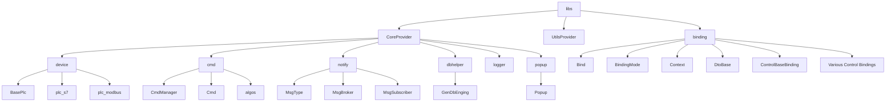
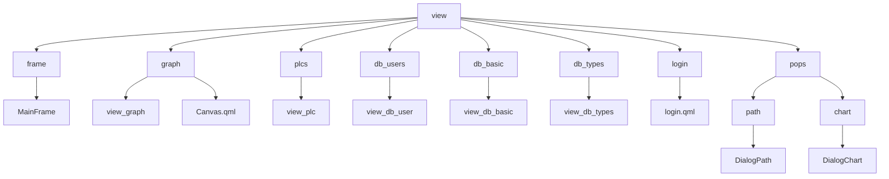
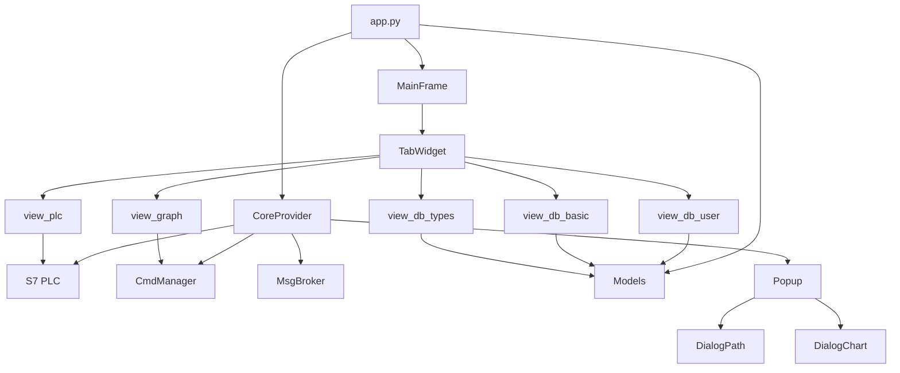
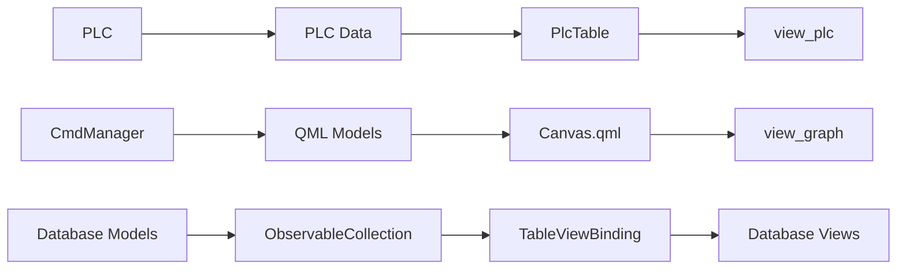
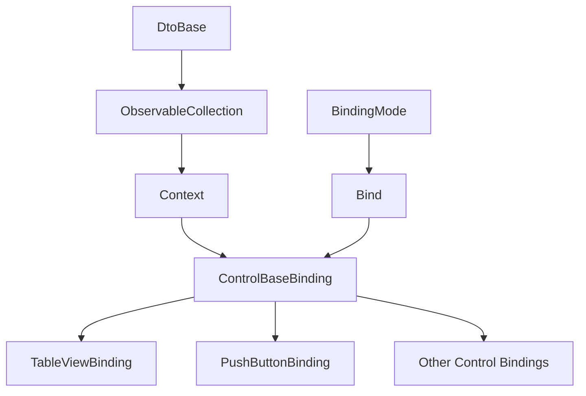

# Application Hierarchy Diagram

## Main Application Structure

```mermaid
graph TD
    A[app.py] --> B[QApplication]
    A --> C[MainFrame]
    A --> D[CoreProvider]
    A --> E[UtilsProvider]
    A --> F[Database Engines]
    A --> G[Data Models]
    
    C --> H[TabWidget]
    C --> I[Views]
    
    D --> J[S7 PLC]
    D --> K[CmdManager]
    D --> L[MsgBroker]
    
    E --> M[Utils]
    
    F --> N[Multiple DB Connections]
    
    G --> O[Database Tables]
```

## Libs Module Hierarchy

```mermaid
graph TD
    A[libs] --> B[CoreProvider]
    A --> C[UtilsProvider]
    
    B --> D[device]
    B --> E[cmd]
    B --> F[notify]
    B --> G[dbhelper]
    B --> H[logger]
    B --> I[popup]
    
    D --> J[BasePlc]
    D --> K[plc_s7]
    D --> L[plc_modbus]
    
    E --> M[CmdManager]
    E --> N[Cmd]
    E --> O[algos]
    
    F --> P[MsgType]
    F --> Q[MsgBroker]
    F --> R[MsgSubscriber]
    
    G --> S[GenDbEnging]
    
    I --> T[Popup]
    
    A --> U[binding]
    
    U --> V[Bind]
    U --> W[BindingMode]
    U --> X[Context]
    U --> Y[DtoBase]
    U --> Z[ControlBaseBinding]
    U --> AA[Various Control Bindings]
```

## Views Module Hierarchy

```mermaid
graph TD
    A[view] --> B[frame]
    A --> C[graph]
    A --> D[plcs]
    A --> E[db_users]
    A --> F[db_basic]
    A --> G[db_types]
    A --> H[login]
    A --> I[pops]
    
    B --> J[MainFrame]
    
    C --> K[view_graph]
    C --> L[Canvas.qml]
    
    D --> M[view_plc]
    
    E --> N[view_db_user]
    
    F --> O[view_db_basic]
    
    G --> P[view_db_types]
    
    H --> Q[login.qml]
    
    I --> R[path]
    I --> S[chart]
    
    R --> T[DialogPath]
    S --> U[DialogChart]
```

## Component Relationships

```mermaid
graph TD
    A[app.py] --> B[MainFrame]
    B --> C[TabWidget]
    C --> D[view_graph]
    C --> E[view_plc]
    C --> F[view_db_user]
    C --> G[view_db_basic]
    C --> H[view_db_types]
    
    A --> I[CoreProvider]
    I --> J[S7 PLC]
    I --> K[CmdManager]
    I --> L[MsgBroker]
    
    D --> K
    E --> J
    
    A --> M[Models]
    F --> M
    G --> M
    H --> M
    
    I --> N[Popup]
    N --> O[DialogPath]
    N --> P[DialogChart]
```

## Data Flow

```mermaid
graph LR
    A[PLC] --> B[PLC Data]
    B --> C[PlcTable]
    C --> D[view_plc]
    
    E[CmdManager] --> F[QML Models]
    F --> G[Canvas.qml]
    G --> H[view_graph]
    
    I[Database Models] --> J[ObservableCollection]
    J --> K[TableViewBinding]
    K --> L[Database Views]
```

## Binding System

```mermaid
graph TD
    A[DtoBase] --> B[ObservableCollection]
    B --> C[Context]
    C --> D[ControlBaseBinding]
    D --> E[TableViewBinding]
    D --> F[PushButtonBinding]
    D --> G[Other Control Bindings]
    
    H[Bind] --> D
    I[BindingMode] --> H
```
